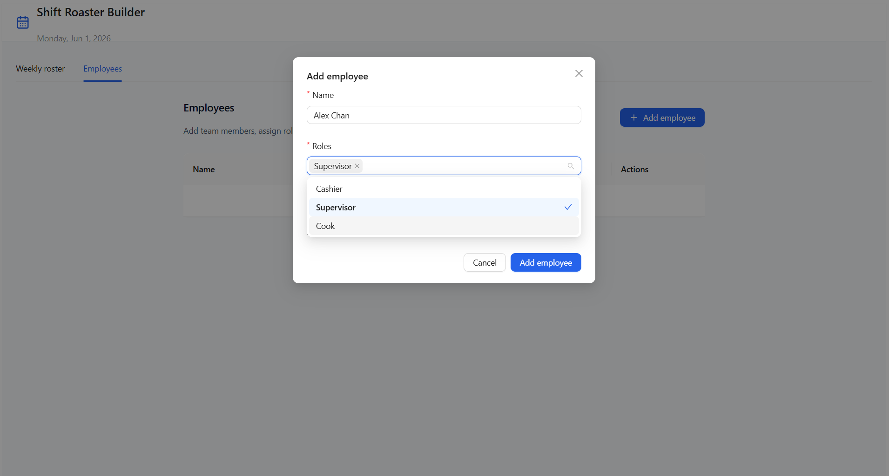
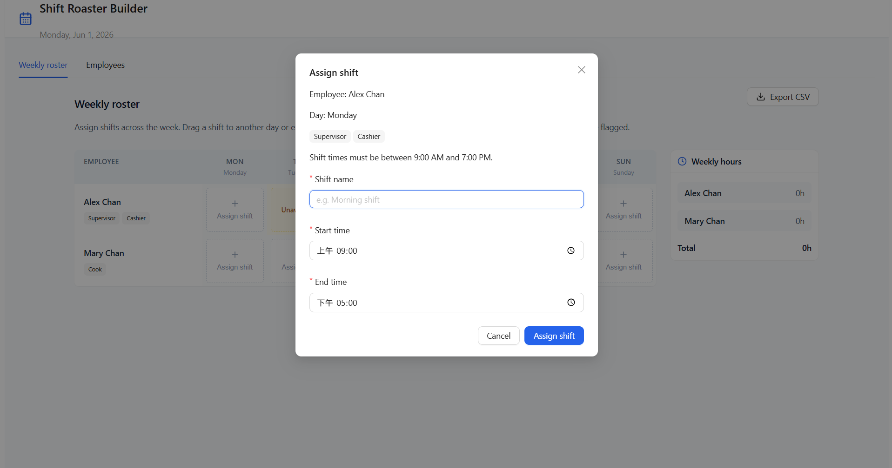
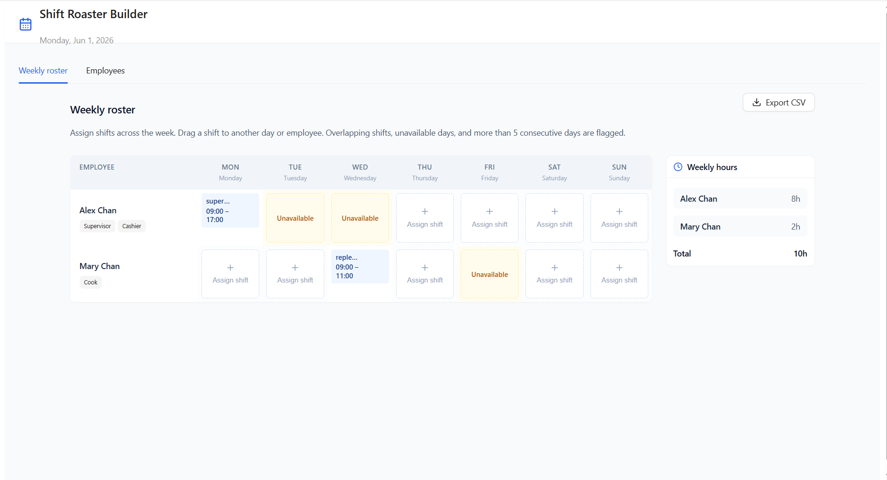

# Shift Roaster Builder

A web app for managers to build and manage a weekly staff schedule for a small team: add employees, assign shifts, view a weekly grid, detect conflicts, and see hours per person.

---

## Screenshots

**Employees** — add team members, assign roles, and mark unavailable days.



**Assign shift** — assign a shift to an employee on a specific day (times limited to 9:00 AM–7:00 PM).



**Weekly roster** — view the full schedule grid, unavailable days, and weekly hours summary. Export the roster as CSV.



---

## Setup

**Requirements:** [Node.js] and npm.

From the project root, run:

```bash
npm install
npm run dev
```

Then open [http://localhost:5173/](http://localhost:5173/) in your browser.

All roster data is kept in memory for the session.

---

## Design decisions

- **MVC-style layout** — `models/` holds plain TypeScript types and constants; `controllers/` owns roster logic (CRUD, validation, hours, CSV export); `views/` are React UI only. This keeps scheduling rules testable and separate from presentation.

---

### Folder structure (MVC)

```

src/
├── models/           # Types & domain shapes (no React)
│   ├── index.ts
│   └── types.ts      # Employee, Shift, SHIFT_EARLIEST/LATEST_TIME,
│                     # conflict types, WEEK_DAY_OPTIONS, ROLE_OPTIONS
├── controllers/      # Hooks, context, business logic
│   ├── index.ts
│   ├── AppProvider.tsx
│   ├── rosterExport.ts          # CSV generation & download
│   └── useRosterController.ts   # CRUD, validation, weekly hours,
│                                # unique names, shift time rules
├── views/            # Presentational React components
│   ├── App.tsx                  # Main app (tabs: roster + employees)
│   ├── EmployeeManager.tsx      # Add/edit/remove employees
│   ├── RosterGrid.tsx           # Grid, modals, drag-and-drop, Export CSV
│   ├── SummaryPanel.tsx         # Weekly hours summary per employee
│   └── components/
│       └── AppShell.tsx
├── main.tsx          # Entry: providers + mount (imports @/views/App)
└── index.css         # Tailwind directives
```

> **Note:** `src/App.tsx` also exists but is unused. The entry point mounts `@/views/App` from `main.tsx`.
